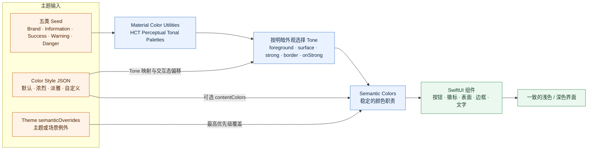

# EasyDesignSystem

EasyDesignSystem 是一套面向 Apple 多平台 SwiftUI 应用的设计系统。它使用统一的语义 API，让 iPhone、iPad、原生 Mac 和 Mac Catalyst 应用快速获得一致、且符合各平台交互习惯的界面，同时为特殊页面保留完整的精细控制能力。

- iOS / iPadOS 17+
- macOS 14+
- Mac Catalyst 17+
- Swift 6
- SwiftUI
- API 前缀：`EDS`

## 1. 设计理念

### 调用方描述“这是什么”

业务代码更适合表达页面结构和业务语义，而不是重复声明颜色、padding、圆角和阴影。

```swift
VStack {
    // 业务内容
}
.easyDesign(.card)
```

调用方只说明这是一张 Card，EasyDesignSystem 负责将它映射为卡片的内边距、语义背景、圆角、边框和阴影。

### ColorScheme 2.0：颜色也表达语义

颜色系统遵循同一原则：业务代码描述颜色承担的职责，而不是直接选择某个固定色值。按钮使用 `brandSurfaceStrong`，提示使用 `warningSurface`，正文使用 `foregroundPrimary`。组件不需要知道最终是蓝色、橙色，还是某个具体十六进制值。

ColorScheme 2.0 将颜色生成分成四层：



图中的主链路负责自动生成完整颜色体系；Color Style 同时影响 Tone 选择和可选前景色，`semanticOverrides` 只处理最终的主题例外。组件始终只读取 Semantic Colors。

#### Seed 决定色系，不直接充当界面颜色

主题提供 Brand、Information、Success、Warning、Danger 五个 Seed。Seed 是生成色调盘的起点，同一个 Seed 会派生出前景、浅色表面、强调表面、边框和强调表面上的内容色。这样可以避免用透明度临时拼色，也能让同一种语义在不同组件中保持一致。

#### 以视觉感知为基础生成明暗层级

底层使用 Google Material Color Utilities 的 HCT 模型生成 Perceptual Tonal Palette。Tone 的变化更接近人眼感受到的明暗变化，因此不同色相在相同层级上拥有更稳定的视觉重量。浅色和深色外观分别选择合适的 Tone，而不是简单反色。

#### 色系与风格彼此独立

Seed 回答“是什么颜色”，Color Style 回答“这种颜色如何呈现”。同一套橙色 Seed 可以使用默认、浓烈或淡雅风格，也可以加载调用方随 App 发布的自定义风格 JSON。风格文件负责 Tone 映射、交互态偏移以及可选的文字/图标前景色，使产品能形成自己的视觉性格，同时避免把风格参数写死在组件代码中。

#### 组件只消费语义角色

组件根据用途读取语义色，不直接读取 Seed。强按钮、柔和按钮、状态徽标、表面、边框和正文各自使用稳定的角色，因此更换 Seed 或 Color Style 时，整个界面可以一致地变化，不需要逐个修改组件。

#### 可读性优先于固定色值

`onStrong` 和正文前景色默认随色调盘自动生成。风格 JSON 可以覆盖这些前景色，但应与对应背景保持至少 4.5:1 的正文对比度。内置风格会通过对比度测试同时验证浅色和深色外观。

#### 覆盖关系保持清晰

颜色从通用到具体依次解析：

```text
Material 自动结果
  → Color Style 的 contentColors
  → Theme 的 semanticOverrides
```

大多数应用只需选择 Seed 和 Color Style；品牌规范需要固定前景色时写入风格文件；只有特定主题或场景的例外才使用 `semanticOverrides`。这一顺序既保留自动配色能力，也允许调用方进行精确控制。

### 易用 API 与精细 API 并行

EasyDesignSystem 提供两层 API：

| API | 适合场景 | 调用方负责 | EasyDesignSystem 负责 |
| --- | --- | --- | --- |
| Easy API | 大多数普通页面 | 声明 Page、Section、Group、Card 等语义 | 整体色彩、宽度、padding 和表面层级 |
| 精细 API | 特殊布局、定制页面、底层组件 | 选择组件、Token 和具体参数 | 提供一致的 Token、组件和渲染原语 |

两层 API 不互相排斥。一个页面可以用 Easy API 管理整体层级，内部继续使用 `EDSButton`、`EDSBadge`、`EDSSettingRow` 等业务语义组件。

### 最佳实践不等于“所有地方都填色”

Page、Content、Section 和 Plain 默认继承宿主背景，让系统外观和原有容器层级自然生效。Group 和 Card 只在需要表达内容分组或独立层级时绘制自适应语义表面。

### Easy API 只作用于组合容器

Easy API 不定义 `.button` 或 `.text` 这类叶子样式。按钮的确定、次要、危险等含义仍由调用方显式提供：

```swift
EDSButton("确定", role: .primary) {
    confirm()
}

EDSButton("删除", role: .danger) {
    delete()
}
```

## 2. 安装

在 Xcode 中选择 **File > Add Package Dependencies**，输入：

```text
https://github.com/kyinwind/EasyDesignSystem.git
```

或在 `Package.swift` 中添加：

```swift
dependencies: [
    .package(
        url: "https://github.com/kyinwind/EasyDesignSystem.git",
        branch: "main"
    )
]
```

然后在 target 中依赖 `EasyDesignSystem` product，并在 Swift 文件中导入：

```swift
import EasyDesignSystem
```

## 3. 使用向导

如果你只想快速开始，完成下面两个步骤就可以使用 EasyDesignSystem。后续章节都是更详细的规则、定制能力和组件参考，可以需要时再阅读。

### 步骤一：在 App 初始化时配置主题

首先导入 EasyDesignSystem，然后在 App 的 `init` 中完成一次全局配置：

```swift
import SwiftUI
import EasyDesignSystem

@main
struct MyApp: App {
    init() {
        EDSTheme.shared.configureTheme { theme in
            theme.seeds.brand = .blue
        }
    }

    var body: some Scene {
        WindowGroup {
            SettingsView()
        }
    }
}
```

如果不想手动配置 Token，也可以直接选择预设主题：

```swift
init() {
    EDSTheme.shared.applyPreset(.orange)
}
```

配置应在 App 启动时完成。V1 暂不需要为运行时动态换肤准备额外状态。

### 步骤二：用 Easy API 编写页面

编写页面时，只需要记住这个常用层级：

```text
Page
└── Section
    ├── Group
    │   └── Row / Toggle / Button
    └── Card
        └── 业务内容
```

- Page 是页面根内容，使用 `.easyDesign()`。
- Section 是页面中的一个信息区块，使用 `.easyDesign(.section)`。
- Group 把同一功能的内容组织在一起，使用 `.easyDesign(.group)`。
- Card 用于需要独立视觉层级的内容，使用 `.easyDesign(.card)`。

下面是一个可直接参考的完整设置页：

```swift
import SwiftUI
import EasyDesignSystem

struct SettingsView: View {
    @State private var automaticUpdates = true

    var body: some View {
        ScrollView {
            VStack(alignment: .leading) {
                EDSPageTitle("设置", subtitle: "管理应用偏好")

                VStack(alignment: .leading) {
                    EDSSectionTitle("通用")

                    VStack(alignment: .leading) {
                        EDSSettingRow(
                            "自动更新",
                            subtitle: "定期检查是否有新版本。"
                        ) {
                            EDSToggle(
                                isOn: $automaticUpdates,
                                label: "启用"
                            )
                        }
                    }
                    .easyDesign(.group)

                    VStack(alignment: .leading) {
                        EDSSectionTitle(
                            "专业版",
                            subtitle: "解锁更多高级功能。"
                        )

                        HStack {
                            EDSBadge("推荐", style: .accent)
                            Spacer()
                            EDSButton("立即升级", role: .primary) {
                                purchase()
                            }
                        }
                    }
                    .easyDesign(.card)
                }
                .easyDesign(.section)
            }
            .easyDesign()
        }
    }

    private func purchase() {
        // 执行业务操作
    }
}
```

这个页面中：

- `.easyDesign()` 自动应用页面 padding、居中的最大宽度、主题前景色和 tint。
- `.section` 建立页面区块的垂直节奏。
- `.group` 自动应用轻量语义背景、padding 和圆角。
- `.card` 自动应用卡片背景、padding、圆角、边框和阴影。
- `EDSButton(role:)` 和 `EDSBadge(style:)` 仍由业务代码指定“主要操作”或“强调状态”等语义。

> Easy API 不会自动添加 `ScrollView`、导航和页面标题，因为这些属于页面结构，应由调用方决定。

到这里就已经完成了 EasyDesignSystem 的基本接入。需要更多场景、局部覆盖、主题或精细组件时，再继续阅读后面的章节。

## 4. Easy API

### 最小用法

`.easyDesign()` 默认等价于 `.easyDesign(.page)`：

```swift
struct SettingsView: View {
    var body: some View {
        VStack(alignment: .leading) {
            Text("设置")

            VStack(alignment: .leading) {
                Text("自动更新")
                EDSToggle(isOn: .constant(true), label: "启用")
            }
            .easyDesign(.group)
        }
        .easyDesign()
    }
}
```

Page 会应用主题环境、tint、默认文本样式、页面 padding 和居中的最大内容宽度。

> `.easyDesign(.page)` 是样式修饰器，不会隐式添加 `ScrollView`、导航或页面标题。需要完整页面骨架时可以使用后文的 `EDSPage`。

### 六种语义场景

| 场景 | 用途 | 默认行为 |
| --- | --- | --- |
| `.page` | 普通页面根内容 | 页面 padding、最大宽度 880、居中、继承背景 |
| `.content` | 已位于导航或滚动容器内的内容 | 轻量 padding、填满可用宽度、继承背景 |
| `.section` | 页面中的信息区块 | 垂直节奏、填满可用宽度、继承背景 |
| `.group` | 同一功能的内容集合 | 分组 padding、subtle 语义表面、圆角、无阴影 |
| `.card` | 需要独立视觉层级的内容 | 卡片 padding、语义表面、圆角、边框和阴影 |
| `.plain` | 只希望子树跟随主题 | 仅应用主题、tint 和文本样式，不改变几何尺寸 |

一个常规页面的层级通常是：

```text
Page
└── Section
    ├── Group
    │   └── Row / Toggle / Button
    └── Card
        └── 业务内容
```

### Page、Section、Group 和 Card

```swift
ScrollView {
    VStack(alignment: .leading) {
        EDSPageTitle("设置", subtitle: "管理应用偏好")

        VStack(alignment: .leading) {
            EDSSectionTitle("通用")

            VStack(alignment: .leading) {
                EDSSettingRow("自动更新") {
                    EDSToggle(isOn: $isEnabled, label: "启用")
                }
            }
            .easyDesign(.group)

            VStack(alignment: .leading) {
                Text("专业版功能")
                EDSButton("升级", role: .primary) {
                    purchase()
                }
            }
            .easyDesign(.card)
        }
        .easyDesign(.section)
    }
    .easyDesign()
}
```

### 局部覆盖

Easy API 只开放少量高频覆盖，避免将易用入口重新扩张成另一套 Token API：

```swift
ContentView()
    .easyDesign(
        .page,
        options: .init(
            padding: .xl,
            maxContentWidth: .fixed(960),
            background: .visible
        )
    )
```

#### Padding

```swift
padding: .automatic  // 使用场景的默认配方
padding: .none       // 明确取消 padding
padding: .xl         // 使用当前主题 spacing.xl
```

可用语义间距为 `.xxs`、`.xs`、`.sm`、`.md`、`.lg`、`.xl`、`.xxl` 和 `.xxxl`。

#### 内容宽度

```swift
maxContentWidth: .automatic
maxContentWidth: .fixed(960)
maxContentWidth: .unlimited
```

#### 背景策略

```swift
background: .automatic
background: .visible
background: .hidden
```

`.automatic` 使用场景配方。`.visible` 要求绘制对应的语义表面，`.hidden` 要求继承父容器背景。

### 嵌套 Easy API

每次显式调用都会生效：

```swift
VStack {
    DetailView()
        .easyDesign(.card)
}
.easyDesign(.page)
```

系统不会猜测或去重调用方的语义。常规页面保持 Page -> Section -> Group/Card 两到四层即可。

### 平台自动适配

同一份页面代码可以直接用于 iOS、iPadOS、macOS 和 Mac Catalyst，无需在业务层导入 AppKit 或 UIKit：

```swift
struct AccountPage: View {
    var body: some View {
        ScrollView {
            VStack(alignment: .leading) {
                EDSPageTitle("账户")
                EDSSettingRow("自动同步") {
                    EDSToggle(isOn: .constant(true), label: "启用")
                }
                .easyDesign(.group)
            }
            .easyDesign(.page)
        }
    }
}
```

EasyDesignSystem 会自动选择交互档案：

| 运行环境 | 默认档案 | 主要行为 |
| --- | --- | --- |
| iPhone / iPad | Touch | 44pt 最小触控目标、紧凑或常规页面边距 |
| 原生 macOS | Pointer | 保留桌面端紧凑控件、启用 Hover 增强 |
| Mac Catalyst | Hybrid | 保证触控目标，同时保留指针 Hover |

页面在紧凑宽度下默认使用 16pt 边距，在常规宽度下默认使用 32pt 边距，内容最大宽度默认是 880pt。显式传入 Easy API 的 `padding` 或 `maxWidth` 时，显式值始终优先。

通常不需要覆盖自动判断；预览特殊环境或构建自定义容器时，可以在局部指定档案：

```swift
ContentView()
    .easyDesignInteractionProfile(.touch)
```

也可以通过主题统一调整自适应值：

```swift
EDSTheme.shared.configure { tokens in
    tokens.adaptiveLayout.compactPagePadding = 20
    tokens.adaptiveLayout.regularPagePadding = 36
    tokens.adaptiveLayout.readableContentMaxWidth = 960
    tokens.adaptiveLayout.minimumTouchTarget = 44
}
```

## 5. 主题

### ColorScheme 2.0

颜色配置采用“种子色 → HCT 色调盘 → 语义颜色”的模型。业务代码配置五个种子色，组件只读取语义角色；浅色与深色外观会分别解析，不需要为每个组件手工维护两套颜色。

```swift
EDSTheme.shared.configureTheme { theme in
    theme.seeds.brand = Color(hexRGB: "#FF6B00")
    theme.seeds.information = Color(hexRGB: "#3185FF")
}

let light = EDSTheme.shared.resolvedColors(for: .light)
let dark = EDSTheme.shared.resolvedColors(for: .dark)
```

可用语义角色覆盖 surface、foreground、border，以及 brand / information / success / warning / danger 五个颜色族。覆盖按明暗模式独立设置：

```swift
EDSTheme.shared.configureTheme { theme in
    theme.semanticOverrides.light[.borderFocus] = "#123456"
    theme.semanticOverrides.dark[.borderFocus] = "#ABCDEF"
}
```

`EDSLayerResolver` 统一决定 base、raised、nested、overlay 层级的表面和边框；`EDSInteractionResolver` 统一生成 rest、hovered、pressed 状态色。

同一个 Seed 可以选择不同的内置色彩风格。风格参数来自包内 JSON，并未写死在组件中：

```swift
EDSTheme.shared.configureTheme { theme in
    theme.seeds.brand = Color(hexRGB: "#FF6B00")
    theme.colorStyle = .vivid       // 浓烈
    // theme.colorStyle = .default  // 平衡，默认
    // theme.colorStyle = .elegant  // 淡雅
}
```

调用者也可以加载自己的风格文件：

```swift
let style = try EDSColorStyle.load(jsonFileURL: url)
EDSTheme.shared.applyColorStyle(style)
```

风格 JSON 还可以按明暗模式覆盖文字和图标前景色。下面是完整风格文件中的 `contentColors` 字段片段；`light`、`dark` 和三组 interaction tone 等其他必填字段可参考包内 `EDSDefaultColorStyle.json`。只需写需要定制的前景角色，未写的角色继续由 Material tonal palette 自动生成：

```json
{
  "contentColors": {
    "light": {
      "foregroundPrimary": "#18120E",
      "brandOnStrong": "#FFFFFF"
    },
    "dark": {
      "foregroundPrimary": "#F7F1ED",
      "brandOnStrong": "#1A0D04"
    }
  }
}
```

支持 `foregroundPrimary`、`foregroundSecondary`、`foregroundTertiary`、`foregroundDisabled`、`foregroundInverse`，以及 `brandOnStrong`、`informationOnStrong`、`successOnStrong`、`warningOnStrong`、`dangerOnStrong`。配置值必须是 `#RRGGBB`；surface 和 border 仍由 tone 配置与主题语义覆盖负责。自定义前景色应与对应背景保持至少 4.5:1 的正文对比度。

解析优先级从低到高为：Material 自动结果 → Color Style 的 `contentColors` → Theme 的 `semanticOverrides`。Catalog 顶部可以同时选择 Seed/主题和默认、浓烈、淡雅三种 Color Style，所有预览会实时刷新，便于提交风格文件前检查整体效果。

主题 JSON 的颜色结构为：

```json
{
  "colors": {
    "style": "default",
    "seeds": {
      "brand": "#3185FF",
      "information": "#3185FF",
      "success": "#27B15A",
      "warning": "#F9B135",
      "danger": "#E54444"
    },
    "semanticOverrides": { "light": {}, "dark": {} }
  }
}
```

旧的 `colors.primary/accent/success/warning/danger` JSON 结构会明确报错，需迁移到 `colors.seeds.*`。

### 全局主题

建议在 App 初始化阶段完成全局配置：

```swift
@main
struct MyApp: App {
    init() {
        EDSTheme.shared.configureTheme { theme in
            theme.seeds.brand = .blue
            theme.spacing.lg = 22
        }
    }

    var body: some Scene {
        WindowGroup {
            ContentView()
        }
    }
}
```

也可以使用内置预设：

```swift
EDSTheme.shared.applyPreset(.orange)
```

当前提供 `.default`、`.blue`、`.orange` 和 `.purple`，其中 `.blue` 是 `.default` 的别名。

> `brand` 是品牌与主要操作的颜色来源；`information` 是信息提示的独立颜色来源。两者默认同为 `#3185FF`，可分别配置。

### 局部主题

局部主题通过 SwiftUI Environment 传递值类型 `EDSThemeData`，不会修改 `EDSTheme.shared`：

```swift
PurchaseCard()
    .easyDesign(.card, theme: .orange)
```

也可以直接传入完整主题：

```swift
var customTheme = EDSThemeData()
customTheme.seeds.brand = .purple

PurchaseCard()
    .easyDesignTheme(customTheme)
    .easyDesign(.card)
```

如果只希望传递主题，不应用任何 Easy 布局或表面：

```swift
ContentView()
    .easyDesignTheme(.purple)

ContentView()
    .easyDesignTheme(customTheme)
```

### 在自定义 View 中读取主题

需要跟随局部主题时，从 Environment 读取：

```swift
struct CustomPanel: View {
    @Environment(\.edsTheme) private var theme

    var body: some View {
        VStack(spacing: theme.spacing.md) {
            // ...
        }
        .foregroundStyle(theme.colors.textPrimary)
    }
}
```

只关心全局主题时，仍可以使用简单的直接读取：

```swift
EDSTheme.shared.spacing.md
EDSTheme.shared.resolvedColors(for: .light).brandForeground
```

V1 要求在 App 启动阶段配置全局主题，暂不承诺运行时修改 `EDSTheme.shared` 后自动刷新已显示的视图。

## 6. 精细 API

当页面需要完整骨架、特殊布局或具体参数时，使用精细 API。

### 完整页面骨架

`EDSPage` 负责页面标题、可选滚动、内容限宽、padding 和 Section 节奏：

```swift
EDSPage("设置", subtitle: "管理应用偏好") {
    EDSPageSection("通用") {
        EDSGroup {
            EDSSettingRow("自动更新", subtitle: "启动后检查新版本。") {
                EDSToggle(isOn: $isEnabled, label: "启用")
            }
        }
    }
}
```

`EDSPage` 默认不显式绘制背景，让宿主窗口的语义背景自然跟随浅色与深色模式。

已经处于自定义 `ScrollView` 或导航容器时，可以只使用 `EDSPageStack`。

### 容器

```swift
// 默认 EDSGroup：浅色分组背景、padding 和圆角
EDSGroup("通用", subtitle: "常用偏好") {
    content
}

// 默认 EDSCard：只提供 padding，不绘制背景
EDSCard {
    content
}

// 需要时显式提供背景
EDSCard(background: EDSTheme.shared.colors.cardBackground) {
    content
}
```

精细组件的默认行为不强制等于 Easy Recipe。例如 Easy `.card` 会提供完整卡片表面，而精细 `EDSCard` 默认是轻量 padding 容器。

### 按钮、徽章与开关

```swift
HStack {
    EDSButton("主要操作", role: .primary) {}
    EDSButton("次要操作", role: .secondary) {}
    EDSButton("轻量操作", role: .soft) {}
    EDSButton("危险操作", role: .danger) {}
    EDSButton("已完成", role: .done) {}
}

HStack {
    EDSBadge("Pro", style: .accent)
    EDSBadge("已完成", style: .success)
    EDSBadge("待处理", style: .warning)
    EDSBadge("失败", style: .danger)
}

EDSToggle(isOn: $isEnabled, label: "启用自动处理")
```

#### 按钮的三个维度

按钮外观由三个**正交**维度决定，可以自由组合：

| 维度 | 取值 | 含义 |
| --- | --- | --- |
| `Emphasis` | `.filled` `.medium` `.soft` `.plain` `.outline` | 视觉分量——这块按钮“多重” |
| `Tone` | `.accent` `.neutral` `.danger` `.success` `.warning` | 语义色调——这块按钮“是什么性质” |
| `Size` | `.small`(28) `.regular`(34) `.large`(44) | 尺寸档位 |

```swift
EDSButton("忽略并删除", emphasis: .soft, tone: .danger) {}
EDSButton("更多", emphasis: .plain, systemImage: "ellipsis") {}
EDSButton("刷新", emphasis: .medium, size: .small) {}
EDSButton("开始处理", emphasis: .filled, size: .large) {}
```

`role:` 参数是一张**预设别名表**：一个角色等价于一组固定的三维组合。

| `Role` | 等价于 |
| --- | --- |
| `.primary` | `filled` + `accent` + `regular` |
| `.secondary` | `medium` + `accent` + `regular` |
| `.soft` | `soft` + `accent` + `regular` |
| `.danger` | `filled` + `danger` + `regular` |
| `.done` | `filled` + `success` + `regular`，并自动补 `checkmark` 图标 |
| `.normal` | `soft` + `neutral` + `regular`（灰底次级操作，工具栏常用档） |

两种写法汇入同一份渲染实现，可以在同一页面里混用。需要自定义预设时，用 `EDSButtonAppearance` 组合三维后自行封装。

> 三维写法要求至少给出 `emphasis:`。这是为了与 `EDSButton("确定") {}` 这类一维写法在编译期区分开——两者若都可省略参数，会产生初始化重载歧义。

标题参数同时接受 `LocalizedStringKey` 与 `String`。App 若自带本地化函数（返回 `String`），可以直接传入，不必再用 `label:` 闭包绕开：

```swift
EDSButton(L("button.cancel"), role: .secondary) { onCancel() }
EDSButton(L("toolbar.refresh"), emphasis: .medium, size: .small) { refresh() }
```

> 字面量调用（如 `EDSButton("确定")`）稳定命中 `LocalizedStringKey` 版本，两种重载并存不产生歧义。

### 文本与行

```swift
EDSPageTitle("设置", subtitle: "管理应用偏好")
EDSSectionTitle("通用", subtitle: "基础设置")
EDSLabelText("输出路径")
EDSCaptionText("修改后会影响新文件。")
EDSMonoText("/Users/name/Documents/Exports")

EDSSettingRow("图片格式", subtitle: "批量处理的默认格式。") {
    EDSBadge("PNG", style: .accent)
}

EDSValueRow("缓存占用", value: "240 MB")
```

### 状态与特殊组件

```swift
EDSEmptyState(
    systemImage: "tray",
    title: "暂无文件",
    message: "添加文件后会显示在这里。",
    actionTitle: "添加文件"
) {
    addFiles()
}

EDSErrorState(
    title: "加载失败",
    message: "请检查网络后重试。",
    actionTitle: "重试"
) {
    retry()
}

EDSLoadingState("正在处理", message: "这通常只需要几秒。")

EDSProgressPanel(
    "模型下载",
    subtitle: "Model.zip",
    fractionCompleted: progress,
    statusText: "正在下载..."
)
```

其他可用组件还包括：

- `EDSHeroPanel`：关键信息或付费权益强调面板。
- `EDSPill` / `EDSPillFlow`：标签和自动换行的标签集合。
- `EDSCollapsibleSection`：可折叠内容区。
- `EDSComparisonSection`：功能对比列表。
- `EDSSidebarGroupView`：设置页式侧边栏分组。

### 直接使用 Token

`EDSThemeData` 包含颜色种子、语义覆盖和以下非颜色 `EDSDesignTokens`：

| Token | 用途 |
| --- | --- |
| `spacing` | `xxs` 到 `xxxl` 的间距尺度 |
| `radius` | `sm` 到 `xl` 的圆角尺度 |
| `typography` | Hero、页面标题、Section、正文、Caption 和等宽字体 |
| `controlSize` | 按钮、输入框和行高 |
| `adaptiveLayout` | 紧凑/常规页面边距、可读宽度和触控目标 |
| `stroke` | 边框粗细 |
| `shadow` | 阴影颜色、透明度、半径和偏移 |
| `heroGradient` | Hero 面板渐变 |

```swift
struct FineGrainedPanel: View {
    @Environment(\.edsTheme) private var theme

    var body: some View {
        VStack(alignment: .leading, spacing: theme.spacing.sm) {
            Text("自定义面板")
                .font(theme.typography.sectionTitle)

            Text("这里使用完整 Token 进行精细控制。")
                .foregroundStyle(theme.colors.textSecondary)
        }
        .padding(theme.spacing.xxxl)
        .background(theme.colors.cardBackground)
        .clipShape(
            RoundedRectangle(
                cornerRadius: theme.radius.lg,
                style: .continuous
            )
        )
    }
}
```

### JSON 主题

可以从 App Bundle 加载 JSON：

```swift
try EDSTheme.shared.configure(jsonResource: "MyAppTheme")
```

从文件 URL 或 Data 加载：

```swift
try EDSTheme.shared.configure(jsonFileURL: url)
try EDSTheme.shared.configure(jsonData: data)
```

导出当前主题：

```swift
let data = try EDSTheme.shared.exportJSON()
let json = try EDSTheme.shared.exportJSONString()
```

## 7. Catalog 与 Preview

### 密集工具栏的命令组合

对于桌面端工具栏，不必把每个操作都做成同等权重的独立按钮，也不必统一塞入含义模糊的“更多”：

```swift
EDSCommandGroup {
    EDSButton("叠加元素", emphasis: .soft, size: .small) {}
    EDSButton("背景音乐", emphasis: .soft, size: .small) {}
}

EDSSplitButton("导出视频", systemImage: "square.and.arrow.up") {
    exportVideo()
} menu: {
    Button("导出 Word") { exportWord() }
    Button("导出讲解词") { exportScripts() }
}

EDSCommandPopover(
    "页面操作",
    isPresented: $showsPageActions,
    size: .small,
    systemImage: "slider.horizontal.3"
) {
    PageActionsView()
}
```

- `EDSCommandGroup` 表达相邻命令属于同一任务域。
- `EDSSplitButton` 保留一键主操作，同时收纳同类替代操作。
- `EDSCommandPopover` 使用明确名称打开结构化浮层，适合页面操作、插入、格式等可继续扩展的命令域。

Package 提供 `EasyDesignSystemCatalog` library target，用于在 Xcode Canvas 中预览设计系统。三个预览界面的职责不同：

| 预览界面 | 用途 | 适合在什么时候使用 |
| --- | --- | --- |
| `EDSDesignSystemGallery` | 精细 API 效果和组件代码参考 | 查看页面骨架、按钮、状态、Row、Pill、Group 和 Card 的实际效果 |
| `EDSDesignSystemPreview` | Token 可视化编辑器 | 调整颜色、间距、圆角、字体、控件尺寸和 Hero 渐变，并导出 JSON |
| `EDSEasyAPIDesignSystemGallery` | Easy API 效果和最短调用参考 | 对照 Page、Content、Section、Group、Card、Plain、局部主题和嵌套场景 |

### EDSDesignSystemGallery

文件：[`Examples/Catalog/EDSDesignSystemGallery.swift`](Examples/Catalog/EDSDesignSystemGallery.swift)

这是精细 API Gallery。界面左侧是组件分类，右侧是对应的设置页式效果与代码摘要。如果需要查找某个 EDS 组件的推荐组合方式，优先查看这个 Gallery。

### EDSDesignSystemPreview

文件：[`Examples/Catalog/EDSDesignSystemPreview.swift`](Examples/Catalog/EDSDesignSystemPreview.swift)

这是主题 Token 编辑器：

- 左侧实时预览组件效果。
- 右侧调整颜色、间距、圆角、字体、控件尺寸和 Hero 渐变。
- 可以选择预设、重置、应用到 Runtime，或导出 `MyAppTheme.json`。

导出的 JSON 可以加入 App target，然后通过 `EDSTheme.shared.configure(jsonResource:)` 加载。

### EDSEasyAPIDesignSystemGallery

文件：[`Examples/Catalog/EDSEasyAPIDesignSystemGallery.swift`](Examples/Catalog/EDSEasyAPIDesignSystemGallery.swift)

这是 Easy API Gallery。它同样使用左侧栏 + 右侧详情的设置页结构，并且刻意不手写容器的 Token、背景、padding、圆角或阴影。如果想看“只描述场景语义”能够获得什么效果，优先查看这个 Gallery。

### 在 Xcode 中打开预览

1. 用 Xcode 打开 EasyDesignSystem Package。
2. 选择 `EasyDesignSystemCatalog` scheme。
3. 打开上述任意一个 Swift 文件。
4. 打开 Canvas，然后启动 `#Preview`。

仓库还提供 `Examples/PlatformCatalog/EDSPlatformCatalog.xcodeproj`，它是真实的多平台宿主 App，可用来编译和检查 iPhone、iPad、原生 macOS与 Mac Catalyst 的共享页面。

建议在各平台的浅色和深色外观下检查 Gallery，特别关注 Page 的背景继承、Group/Card 的层级、触控目标以及局部主题作用域。

## 8. 开发与验证

```bash
swift build
swift test
Scripts/check-api-compatibility.sh
Scripts/validate-platform-builds.sh
```

如果本机同时安装了 Command Line Tools 和 Xcode，请确保使用与当前 macOS SDK 匹配的 Swift 工具链。

升级既有 macOS 项目或主题 JSON 时，请参阅 [`docs/多平台迁移指南.md`](docs/多平台迁移指南.md)。平台边界、颜色导出规则和当前限制也记录在该文档中。

## 9. License

See [`LICENSE`](LICENSE).
