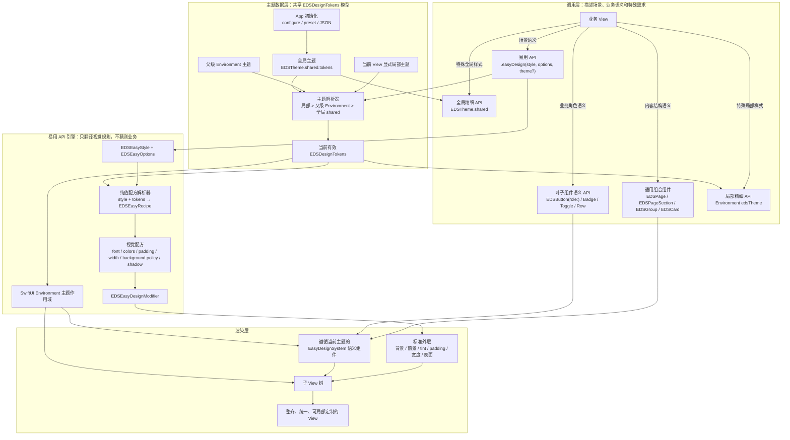

# EasyDesignSystem 增加易用 API 方案和计划

> 日期：2026-07-21  
> 状态：实施中（代码、测试与 Gallery 已完成，待人工浅色/深色视觉验收）  
> 适用范围：EasyDesignSystem（macOS 14+ / Swift 6 / SwiftUI）

## 1. 背景与目标

当前 `EDSTheme` 的初始化已经比较简单：

```swift
EDSTheme.shared.configure { tokens in
    tokens.colors.primary = .blue
}
```

但自定义 View 在使用样式时，仍然需要大量重复写法：

```swift
VStack(spacing: EDSTheme.shared.spacing.lg) {
    // ...
}
.padding(EDSTheme.shared.spacing.xxl)
.foregroundStyle(EDSTheme.shared.colors.textPrimary)
.background(EDSTheme.shared.colors.pageBackground)
```

本次升级的目标是提供两种明确的使用模式：

1. **易用 API（默认推荐）**：调用方将一个 View 声明为 EasyDesignSystem 风格，由系统按场景自动应用主题、字体、颜色、padding、背景、圆角和阴影等最佳实践。
2. **精细 API（高级能力）**：保留现有 Token、组件和自定义能力，供特殊页面进行局部调整。

期望多数普通页面只需要：

```swift
struct PurchaseView: View {
    var body: some View {
        PurchaseContent()
            .easyDesign()
    }
}
```

### 1.1 最终目标

EasyDesignSystem 的最终目标不是让调用方以另一种写法手工指定每个颜色和距离，而是：

> 让调用方用最短、最容易理解的 API，获得一个排版整齐、视觉统一、适配平台且可继续精细定制的 View。

普通调用方应该主要描述“这是什么”，而不是反复描述“它的 padding 是多少、背景是什么颜色、圆角是多大”。

## 2. 核心设计原则

### 2.1 简单优先，但行为必须可预测

`.easyDesign()` 应当有稳定、可解释的默认行为，不根据 View 的私有结构做隐式猜测，不在版本更新时意外改变页面结构。

### 2.2 语义场景优先，不让使用者先选数值

易用层使用 `page`、`content`、`group`、`card`、`plain` 这类语义，而不是要求调用方先决定 `16`、`24` 或某个具体颜色。具体值由当前主题 Token 解析。

### 2.3 默认值可用，特殊需求可退回精细 API

易用 API 不会取代 `EDSTheme`、`EDSDesignTokens`、`EDSPage`、`EDSGroup`、`EDSButton` 等现有 API。两层 API 使用同一份 Token，避免出现两套不一致的风格逻辑。

### 2.4 `EDSTheme.shared` 与 SwiftUI Environment 并行

本次升级不使用 Environment 取代 `EDSTheme.shared`，而是让两种访问方式同时作为正式 API：

- `EDSTheme.shared` 是简单直接的全局配置与访问入口，适合 App 初始化、简单 View 和非 SwiftUI 场景。
- `@Environment(\.edsTheme)` 是 SwiftUI 主题作用域入口，适合子 View 继承、局部主题、Preview 和测试。

两种方式并行，但不建立两套互不相关的主题系统。Environment 未被局部覆盖时，默认使用 `EDSTheme.shared.tokens`；一旦被局部覆盖，Environment 读取局部主题，而直接读取 `EDSTheme.shared` 仍然得到全局主题。

### 2.5 保持渐进兼容

现有的以下写法继续有效：

```swift
EDSTheme.shared.configure { tokens in
    tokens.colors.primary = .blue
}

EDSTheme.shared.spacing.lg
EDSPage { /* ... */ }
EDSButton("Save") { /* ... */ }
```

本次新增更简单的入口，不在第一版删除现有公开 API。

## 3. SwiftUI 能力边界

### 3.1 本项目对“最佳实践”的定义

“这个 View 遵从 EasyDesignSystem 最佳实践”不等于“DesignSystem 自动理解全部业务”。它表示调用方与 DesignSystem 之间建立了一份清晰契约：

> 调用方决定内容是什么、操作意味着什么；EasyDesignSystem 决定这些内容应该如何被一致、整齐、美观地呈现。

可以简化为：

> 业务层说“是什么”，DesignSystem 决定“怎么显示”。

### 3.2 EasyDesignSystem 应当自动负责的内容

#### 整体色彩

- 背景首先是一种策略：可以继承父容器，也可以绘制自适应语义表面；不绘制背景是明确的最佳实践，不代表配置缺失。
- 页面背景、容器背景和分组背景的层级关系。
- 默认前景色、次要文字色、tint 和边框色。
- 颜色之间的对比度，以及浅色/深色外观适配。
- 将颜色语义统一映射到当前主题，避免页面随意混用原始颜色。

#### 排版与视觉节奏

- 页面外层 padding、内容最大宽度和默认对齐方式。
- 标题、正文、辅助说明之间的字体层级与行高。
- 页面、section、group、row 和控件之间稳定的间距节奏。
- 卡片和分组的 padding、圆角、边框和阴影层级。
- 可读性导向的内容宽度，避免内容过宽或过度拥挤。

#### 组件的默认视觉和交互质量

- 已指定语义角色后，按钮、Badge、Toggle、Row 等组件的颜色、尺寸和形态。
- hover、pressed、disabled、selected、loading 和 error 等状态的一致反馈。
- 合理的控件尺寸、点击区域、焦点状态和键盘操作体验。

#### 平台与可访问性适配

- 优先使用系统语义颜色和字体能力，适配 macOS 外观。
- 对文字扩展、本地化长文本、高对比度和减少动效保留正确的布局与交互空间。
- 不仅“截图看起来好看”，还要在实际交互状态中保持可用。

### 3.3 调用方必须负责的内容

EasyDesignSystem 不应猜测以下业务语义：

- 按钮是确认、取消、删除、购买还是普通跳转。
- 哪个操作是页面的主要操作，哪个是危险操作。
- 某段文字是页面标题、section 标题、正文还是辅助说明。
- 内容之间的业务分组关系、展示顺序和信息优先级。
- 页面是否需要滚动、导航、弹窗、确认流程或特殊交互。
- 某个值是成功、警告、错误还是普通信息。

调用方只需要给出语义，不需要同时指定具体样式：

```swift
EDSButton("Delete", role: .danger) {
    deleteItem()
}
```

调用方决定 `.danger`，EasyDesignSystem 决定 danger 按钮的颜色、字体、尺寸、圆角、hover、pressed 和 disabled 状态。

### 3.4 责任边界表

| 问题 | 谁决定 | 例子 |
| --- | --- | --- |
| 这是什么场景 | 调用方 | `.page`、`.section`、`.group`、`.card` |
| 这是什么业务操作 | 调用方 | `.primary`、`.secondary`、`.danger` |
| 操作如何显示 | EasyDesignSystem | 颜色、字体、高度、圆角、交互状态 |
| 页面的内容是什么 | 调用方 | 标题、文案、数据、操作 |
| 页面如何形成视觉秩序 | EasyDesignSystem | 页面 padding、内容宽度、默认对齐、背景层级 |
| 哪些内容属于同一组 | 调用方 | 使用 `EDSGroup` 或 `.easyDesign(.group)` |
| 分组的间距与表面样式 | EasyDesignSystem | Token 映射的 spacing、padding、background、radius |

### 3.5 最佳实践的落地范围与层次

Easy API 只落到具有布局或视觉边界的通用组合容器，不直接落到 `Button`、`Text`、`Toggle`、`Badge`、`Row` 等叶子组件上。它的价值是让调用方指定一个组合式 View 后，整个组合的外层布局、表面和主题环境自然遵从最佳实践，而不是换一种方式逐个设置底层控件。

V1 的层次固定为：

```text
Page
├── Section
│   ├── Group
│   │   └── Row / Button / Toggle / Text
│   ├── Card
│   │   └── 业务内容
│   └── Content
└── Content
```

各层职责如下：

| 层级 | Easy Style | 对应现有组件 | 职责 |
| --- | --- | --- | --- |
| 主题作用域 | `.plain` | 无特定组件 | 只传递主题、tint 和默认文本环境，不改变几何尺寸 |
| 页面 | `.page` | `EDSPage`、`EDSPageStack` | 页面背景、外层 padding、最大内容宽度和整体对齐 |
| 内容区域 | `.content` | 暂无专门组件 | 为已经位于导航、滚动或其他容器中的普通组合内容建立轻量布局 |
| 页面区块 | `.section` | `EDSPageSection` | 标题、副标题、区块内容以及区块之间的垂直节奏 |
| 功能分组 | `.group` | `EDSGroup` | 表达内容属于同一功能集合，提供分组表面和内边距 |
| 独立卡片 | `.card` | `EDSCard` | 表达可独立识别的视觉对象，提供更明确的层级和表面 |

`.section`、`.group` 和 `.card` 的语义不能互相替代：

- Section 表达页面信息结构，通常包含标题或说明，但不一定有背景。
- Group 表达同一功能集合，通常使用 subtle 背景、圆角和 padding，默认没有阴影。
- Card 表达独立视觉对象，层级高于 Group，可以使用边框和轻阴影。

叶子组件仍然需要自己的语义 API，例如 `EDSButton(role: .danger)`；调用方负责声明业务角色，组件负责具体视觉和交互状态。它们不扩展为 `.easyDesign(.button)`、`.easyDesign(.text)` 等细粒度 Easy Style。

以下现有组合组件具有明确、专用的业务或展示语义，V1 继续使用具名 API，不加入通用 `EDSEasyStyle`：

- `EDSHeroPanel`
- `EDSCollapsibleSection`
- `EDSProgressPanel`
- `EDSEmptyState` / `EDSErrorState` / `EDSLoadingState`
- `EDSComparisonSection`
- `EDSSidebarGroupView`

只有当未来多个真实 App 反复出现相同的通用容器需求时，才考虑增加 `.hero`、`.form`、`.sidebar` 等新场景，避免把 Easy API 重新扩张成细粒度组件目录。

### 3.6 “一行 API”的保证等级

`.easyDesign()` 对任意 View 的默认保证是：

- 建立统一的主题环境。
- 统一页面外层背景、前景色、tint、padding、宽度和对齐。
- 让子树中已经表达了语义的 EasyDesignSystem 组件自动获得一致样式。

如果一个 View 的内部全部使用无语义的原生 `Text`、`Button`、`VStack`，`.easyDesign()` 可以统一外层视觉，但无法凭空判断内部信息层级。要获得更完整的自动排版，调用方需要使用 `EDSPageTitle`、`EDSPageSection`、`EDSGroup`、`EDSButton` 等语义组件。

因此，最简使用路径分为两级：

```swift
// 一行获得整体视觉秩序
content.easyDesign()

// 用少量语义组件获得更完整的内部排版秩序
EDSPage("Purchase") {
    EDSGroup("Plan") {
        content
    }
}
```

### 3.7 SwiftUI 的实现边界

一个 View modifier 可以稳定地做到：

- 注入当前主题 Token。
- 设置 `tint`、默认字体和默认前景色。
- 为被修饰的 View 应用页面级 padding、背景、最大宽度、圆角、边框和阴影。
- 让 EasyDesignSystem 组件自动跟随局部主题。

但它不能可靠地做到：

- 遍历与改写调用方私有的 `VStack` / `HStack` 内部参数。
- 自动判断某个普通 `Button` 是主要、次要还是危险操作。
- 在不改变语义和交互的前提下，自动插入 `ScrollView`、重排内部层级或替换所有系统控件。

因此，“这个 View 都遵从最佳实践”在 V1 中的准确含义是：

> 自动标准化该 View 的外层容器样式和整棵子树的主题环境；内部需要语义判断的结构，使用 EasyDesignSystem 组件或语义间距 API 表达。

## 4. 拟议公开 API

### 4.1 零配置入口

```swift
extension View {
    /// 按默认页面规则应用 EasyDesignSystem。
    public func easyDesign() -> some View

    /// 按指定语义场景应用 EasyDesignSystem。
    public func easyDesign(_ style: EDSEasyStyle) -> some View
}
```

默认等价于 `.easyDesign(.page)`：

```swift
PurchaseContent()
    .easyDesign()
```

### 4.2 语义场景

```swift
public enum EDSEasyStyle: Sendable {
    case page
    case content
    case section
    case group
    case card
    case plain
}
```

V1 预设职责：

| 场景 | 用途 | 自动应用 |
| --- | --- | --- |
| `.page` | 普通页面根内容 | 主题环境、tint、默认文本样式、默认继承窗口背景、页面 padding、居中的最大内容宽度 |
| `.content` | 已经位于导航或滚动容器内的内容 | 主题环境、tint、文本样式、轻量内边距，不添加背景与阴影 |
| `.section` | 页面中的信息区块 | section 标题与内容的间距、区块间垂直节奏，不强制添加背景或阴影 |
| `.group` | 同一功能的内容组 | 分组 padding、自适应 subtle 表面、圆角，默认无阴影 |
| `.card` | 需要独立层级的内容 | 卡片 padding、自适应语义表面、圆角、边框和轻阴影 |
| `.plain` | 只希望子树跟随主题 | 仅主题环境、tint 和默认文本样式，不改变几何尺寸 |

V1 具体 Token 映射固定为：

| 场景 | Padding | 宽度 | 背景策略 | 圆角 | 边框 | 阴影 |
| --- | --- | --- | --- | --- | --- | --- |
| `.page` | `spacing.xxl` 全方向 | 最大 880，居中 | 继承 | 无 | 无 | 无 |
| `.content` | `spacing.md` 全方向 | 填满可用宽度，左对齐 | 继承 | 无 | 无 | 无 |
| `.section` | `spacing.xs` 垂直方向 | 填满可用宽度，左对齐 | 继承 | 无 | 无 | 无 |
| `.group` | `spacing.lg` 全方向 | 填满可用宽度，左对齐 | `colors.subtleFill` | `radius.md` | 无 | 无 |
| `.card` | `spacing.lg` 全方向 | 填满可用宽度，左对齐 | `colors.cardBackground` | `radius.md` | `colors.border` + `stroke.hairline` | 当前主题 `shadow` |
| `.plain` | 无 | 不改变 | 继承 | 无 | 无 | 无 |

六种场景都应用当前主题的 `colors.accent` tint、`typography.body` 默认字体和 `colors.textPrimary` 默认前景色。`section` 的垂直 padding 只负责区块节奏，标题与内容的结构间距仍由 `EDSPageSection` 或调用方的栈布局表达。

`.page` 不会隐式加入 `ScrollView`。需要滚动、页面标题或 section 骨架时，仍然优先使用 `EDSPage`。

### 4.3 局部主题

单个 View 可以显式使用不同主题：

```swift
PurchaseContent()
    .easyDesign(.page, theme: .orange)
```

拟议增加：

```swift
extension View {
    public func easyDesign(
        _ style: EDSEasyStyle = .page,
        theme: EDSPresetTheme
    ) -> some View

    public func easyDesign(
        _ style: EDSEasyStyle = .page,
        tokens: EDSDesignTokens
    ) -> some View

    public func easyDesignTheme(_ tokens: EDSDesignTokens) -> some View

    public func easyDesignTheme(_ theme: EDSPresetTheme) -> some View
}
```

`easyDesignTheme(_:)` 只建立主题作用域，不添加 padding 或背景，适合 App 根视图、预览和特殊容器。

### 4.4 少量局部覆盖

易用 API 允许覆盖少数常用属性，但不把方法参数扩张成另一套 Token 系统：

```swift
PurchaseContent()
    .easyDesign(
        .page,
        options: .init(
            padding: .xl,
            maxContentWidth: .fixed(960),
            background: .visible
        )
    )
```

拟议类型：

```swift
public struct EDSEasyOptions: Sendable {
    public var padding: EDSSpace
    public var maxContentWidth: EDSEasyWidth
    public var background: EDSEasyVisibility
}

public enum EDSSpace: Sendable {
    case automatic
    case none
    case xxs, xs, sm, md, lg, xl, xxl, xxxl
}

public enum EDSEasyWidth: Sendable {
    case automatic
    case fixed(CGFloat)
    case unlimited
}

public enum EDSEasyVisibility: Sendable {
    case automatic
    case visible
    case hidden
}
```

- `padding == .automatic` 表示使用当前 `EDSEasyStyle` 的最佳实践；`.none` 表示明确取消 padding。
- `padding` 不使用 `EDSSpace?`；因为 Swift 会将可选枚举参数中的 `.none` 优先解释为 `Optional.none`，与“明确取消 padding”语义冲突。增加 `.automatic` 后三种状态均无歧义。
- 三态属性使用 `.automatic`、明确值和关闭值表达，不用含义模糊的 `nil` 同时承担多种职责。
- `EDSSpace` 在内部根据当前主题解析，调用方不再需要写 `EDSTheme.shared.spacing.xl`。
- V1 不开放任意颜色、圆角和阴影参数；这些需求直接使用 Token 或 SwiftUI modifier，保持易用层简洁。

### 4.5 精细 API 的两种访问方式

简单场景可以继续直接读取全局主题：

```swift
struct SimplePanel: View {
    var body: some View {
        VStack(spacing: EDSTheme.shared.spacing.md) {
            // ...
        }
    }
}
```

需要跟随父级或局部主题时，自定义 View 从 Environment 读取：

```swift
struct CustomPanel: View {
    @Environment(\.edsTheme) private var theme

    var body: some View {
        VStack(spacing: theme.spacing.md) {
            // ...
        }
    }
}
```

两种写法都是受支持的精细 API。它们的关键差异是：

- `EDSTheme.shared.spacing.md` 始终读取全局主题，写法直接。
- `theme.spacing.md` 读取当前 SwiftUI 作用域主题，会遵循上层局部覆盖。

## 5. 调用示例

### 5.1 大多数页面：一行启用

```swift
struct PurchaseView: View {
    var body: some View {
        VStack {
            Text("Upgrade")
            EDSButton("Purchase") {
                purchase()
            }
        }
        .easyDesign()
    }
}
```

### 5.2 希望获得完整的标准页面骨架

```swift
EDSPage("Purchase", subtitle: "Choose a plan") {
    PricingContent()
}
.easyDesignTheme(EDSTheme.shared.tokens)
```

`EDSPage` 负责标题、滚动、宽度和区块间距；主题作用域负责一致的 Token。

### 5.3 某个子区域使用卡片最佳实践

```swift
PlanDetails()
    .easyDesign(.card)
```

### 5.4 特殊页面使用精细 API

```swift
struct CustomPurchaseView: View {
    @Environment(\.edsTheme) private var theme

    var body: some View {
        VStack(spacing: theme.spacing.sm) {
            // 特殊布局
        }
        .padding(theme.spacing.xxxl)
        .background(theme.colors.pageBackground)
    }
}
```

## 6. 内部架构方案

### 6.1 技术架构图



这张图体现了四个关键架构决定：

1. **一份 Token 模型，两种访问通道**：`EDSTheme.shared` 和 Environment 不形成两套主题；前者表示全局主题，后者增加作用域和局部覆盖。
2. **业务语义与视觉规则分层**：调用方给出 `.page`、`.section`、`.card`、`.danger` 等语义，EasyDesignSystem 将语义和 Token 翻译成具体视觉。
3. **样式解析与 SwiftUI 渲染分离**：先产生可测试的纯值 `EDSEasyRecipe`，再由 `EDSEasyDesignModifier` 应用，避免规则散落在大量 View 分支中。
4. **外层自动化与内部语义化配合**：`.easyDesign()` 建立整体视觉秩序；Page、Section、Group、Card 等组合层级由通用容器表达，按钮等叶子组件只要求调用方声明业务角色。

### 6.2 主题与样式解析流程

`.easyDesign()` 构建 View 时按以下流程工作：

1. 读取调用方指定的 `EDSEasyStyle` 和可选 `EDSEasyOptions`。
2. 按优先级解析当前有效的 `EDSDesignTokens`。
3. 将 style、options 和 tokens 交给纯值配方解析器。
4. 得到不包含业务逻辑的 `EDSEasyRecipe`。
5. `EDSEasyDesignModifier` 应用外层布局和视觉，同时把有效主题注入子 View 树。
6. EasyDesignSystem 语义组件读取局部主题；显式访问 `EDSTheme.shared` 的代码仍读取全局主题。

### 6.3 主题来源与优先级

主题解析顺序固定为：

1. `easyDesign(..., theme:)` 显式传入的局部主题。
2. 上层 `easyDesignTheme(_:)` 或 `.easyDesign(...)` 注入的 Environment 主题。
3. `EDSTheme.shared.tokens` 中的全局主题。

局部主题只对当前 View 子树生效，不修改全局单例。

上述优先级只适用于 Environment 访问和基于 Environment 的易用 API。调用方显式读取 `EDSTheme.shared` 时，始终获得全局主题，不受局部 Environment 覆盖影响。

### 6.4 拟新增文件

- `Sources/EasyDesignSystem/EDSEnvironment.swift`：Environment key、`EnvironmentValues.edsTheme`、主题作用域。
- `Sources/EasyDesignSystem/EDSEasyDesign.swift`：`EDSEasyStyle`、`EDSEasyOptions`、`EDSSpace` 和 View modifier。
- `Sources/EasyDesignSystem/EDSEasyRecipe.swift`：纯值视觉配方与样式解析逻辑。
- `Tests/EasyDesignSystemTests/EDSEasyDesignTests.swift`：易用 API 的编译、解析和主题优先级测试。
- `Examples/Catalog/EDSEasyAPIDesignSystemGallery.swift`：只使用 Easy API 构建的独立示例与代码参考。

### 6.5 精细组件与 Easy Recipe 的关系

按照决策九的推荐兼容方案，精细组件与 Easy API 共用 `EDSDesignTokens` 和内部布局/表面渲染原语，但不强制已有组件的默认参数等于 Easy Recipe：

```text
EDSDesignTokens
├── 内部 Layout / Surface 原语
│   ├── 精细组件
│   │   └── EDSPage / EDSPageSection / EDSGroup / EDSCard
│   └── EDSEasyDesignModifier
└── EDSEasyRecipe
    ├── .page / .content / .section
    └── .group / .card / .plain
```

`EDSEasyRecipe` 是 Easy API 的唯一场景配方来源。精细组件继续提供结构、行为和显式参数；可复用的 padding、背景、圆角、边框、阴影渲染代码抽取为内部原语，避免复制实现，但不因此改变现有公开默认值。

Gallery 明确拆分为两套并行参考：

- `EDSDesignSystemGallery`：精细 API Gallery。保留 Token、组合组件和精细参数的完整写法，展示可定制能力，并为高级调用方提供代码参考。
- `EDSEasyAPIDesignSystemGallery`：Easy API Gallery。使用 `.easyDesign(...)` 和必要的业务语义组件实现相同层次的页面，展示最短调用路径，并为多数调用方提供代码参考。

两套 Gallery 应尽量覆盖相同的 Page、Content、Section、Group、Card、Plain 场景，方便用户对照“精细控制”和“快速最佳实践”。Easy Gallery 中不得为了补齐样式而重新出现大量 `EDSTheme.shared.spacing...`、手写背景、圆角和阴影；一旦出现，说明相应 Easy Recipe 仍不完整。

### 6.6 内部组件支持主题作用域

需要自动跟随上层局部主题的内置 SwiftUI 组件，使用：

```swift
@Environment(\.edsTheme) private var theme

theme.spacing.md
```

公开的 `EDSTheme.shared` 访问能力完整保留，不标记废弃，也不强制调用方迁移到 Environment。内置组件是否使用 Environment，以“该组件是否应当跟随局部主题”为判断标准，而不是为了消除所有 `EDSTheme.shared` 写法。

### 6.7 避免初始化时过早固化 Token

现有部分组件在 initializer 默认参数中直接读取 `EDSTheme.shared`。迁移时改为“语义默认值 + body 阶段解析”，避免 View 创建时就把全局 Token 固化，导致局部主题失效。

### 6.8 需要在实现前确认的架构决策

以下问题会直接影响 API 的长期形态，应在阶段 A 充分讨论后再编码：

#### 决策一：Environment 中保存什么

**状态：已确认。** Environment 直接保存值类型 `EDSDesignTokens`，不保存 `EDSTheme` 单例或可变管理对象。局部主题是明确的值快照，不会意外修改全局状态，也更容易测试。

#### 决策二：`EDSEasyRecipe` 是否公开

**状态：已确认。** `EDSEasyRecipe` 在 V1 保持内部类型。调用方只接触 `EDSEasyStyle` 和 `EDSEasyOptions`；内部配方可以继续演进，不形成过早的兼容性负担。测试使用 `@testable import` 验证配方映射。后续出现明确的外部扩展需求后，再评估是否公开。

#### 决策三：`.easyDesign()` 是否默认等于 `.page`

**状态：已确认。** `.easyDesign()` 等价于 `.easyDesign(.page)`。如果调用方只希望传递主题而不改变布局，应显式使用 `.easyDesign(.plain)` 或 `.easyDesignTheme(_:)`。

#### 决策四：局部主题参数接受哪种类型

需要在易用性与 API 数量之间选择：

```swift
content.easyDesign(.page, theme: .orange)
content.easyDesign(.page, tokens: customTokens)
```

**状态：已确认。** 同时支持 `EDSPresetTheme` 和 `EDSDesignTokens`，由两个明确重载实现，不引入额外的 `AnyTheme` 类型。

#### 决策五：Options 如何表达“自动、关闭和自定义”

**状态：已确认。** 简单的 optional 无法同时区分“使用场景默认值”和“明确取消限制”。对存在三态的属性使用语义策略：

```swift
public enum EDSEasyWidth: Sendable {
    case automatic
    case fixed(CGFloat)
    case unlimited
}

public enum EDSEasyVisibility: Sendable {
    case automatic
    case visible
    case hidden
}
```

外部 API 保持短小，内部不依赖含义模糊的 `nil`。

#### 决策六：嵌套 `.easyDesign()` 的规则

**状态：已确认。** 每次显式调用都生效，保证行为容易理解：

```swift
VStack {
    DetailView()
        .easyDesign(.card)
}
.easyDesign(.page)
```

外层提供页面规则，内层明确增加卡片规则。系统不自动忽略重复调用，也不猜测调用方是否“误加”了第二个 `.page`；文档和语义类型负责降低误用。

正常页面通常只有 Page → Section → Group/Card 两到四层 Easy modifier。每层只进行常量级配方解析并增加少量 SwiftUI modifier，这类嵌套本身不会形成明显渲染压力。实现必须遵守以下性能约束：

- `EDSEasyRecipe` 是无状态纯值，不创建观察对象或订阅。
- 不使用 `AnyView`、`GeometryReader` 或额外 `@State` 实现样式分派。
- Environment 只传递值类型 Token；V1 不动态换肤，因此不会持续触发整棵子树刷新。
- 只在 `.card` 等确实需要的场景使用阴影、裁剪等可能增加离屏渲染成本的效果。
- 每种 Recipe 只应用非空规则，`.plain` 不增加几何布局与表面绘制。

因此性能风险主要来自调用方主动叠加大量阴影、模糊和复杂内容，而不是正常的 Easy modifier 层级。Catalog 验收时增加一个多 Section、多 Group/Card 的压力页面进行观察。

#### 决策七：V1 是否支持运行时动态换肤

**状态：已确认。** V1 不支持运行时动态换肤。继续要求在 App 初始化阶段完成全局配置，局部主题以 Environment 值传递；后续出现换肤需求时，再将主题状态升级为可观察模型。

#### 决策八：规则合并优先级

**状态：已确认。** 固定为：

1. 调用方显式 `EDSEasyOptions`。
2. `EDSEasyStyle` 的场景配方。
3. 当前主题 `EDSDesignTokens`。
4. EasyDesignSystem 内置安全默认值。

这一顺序意味着调用方可以覆盖场景默认值，但无需复制整套配方。

#### 决策九：现有组合组件的默认视觉是否必须改成 Easy Recipe

**状态：已确认采用兼容方案。** 当前 `EDSPage`、`EDSCard` 等精细组件的默认行为与 Easy Recipe 不必完全相同。保留现有精细组件默认行为，Easy Recipe 独立提供强约束最佳实践；两层共用 Token 和底层渲染原语，但不强迫所有默认参数相同。

选择兼容方案的原因：

- 不让现有调用方升级后发生意外视觉变化。
- 符合“精细 API + Easy API”两套入口、两套 Gallery 的定位。
- `EDSPage` 默认透明、`EDSCard` 默认只提供 padding 都可以是明确的最佳实践，而不是缺少样式。
- 精细 Gallery 通过显式参数展示定制能力，Easy Gallery 通过语义场景展示最短路径。

#### 决策十：Environment 的全局回退如何实现

**状态：已确认。** 内部 Environment Key 保存可选的局部 `EDSDesignTokens`，默认是 `nil`；公开的 `EnvironmentValues.edsTheme` 和 Easy modifier 按“局部值优先，否则读取 `EDSTheme.shared.tokens`”解析。这样既不会在静态 `defaultValue` 初始化时过早冻结全局主题，也能保证 App 启动阶段的 `configure` 正常生效。

V1 不承诺 `configure` 后自动刷新已经显示的 View；这与暂不支持动态换肤的决策一致。

#### 决策十一：Recipe 中的背景如何定义

**状态：已确认。** 背景定义为语义策略，而不是“必须存在的颜色值”：

- `.page`、`.content`、`.section`、`.plain` 默认继承所在容器或窗口的背景。
- `.group` 使用随系统浅色/深色变化的 subtle 语义表面。
- `.card` 使用随系统浅色/深色变化的 card 语义表面，以表达独立视觉层级。
- 调用方可通过 `EDSEasyOptions.background` 在 `.automatic`、`.visible`、`.hidden` 之间覆盖。

透明继承和显式语义背景都可以跟随系统外观；区别是前者保留宿主层次，后者建立新的视觉表面。Recipe 必须把“继承背景”记录为明确策略，不能把它当成漏配。

## 7. 实施计划

> 执行规则：以下实施项目初始保持未勾选。开始开发后，每完成一项并通过对应验证，就将 `[ ]` 改为 `[x]`；不提前勾选。

### 阶段 A：固定 API 契约

- [x] 将“调用方提供业务语义，EasyDesignSystem 提供视觉与交互规则”固定为 API 责任边界。
- [x] 确认 Easy API 落到 Page、Content、Section、Group、Card 和 Plain 六类通用组合容器，不落到 Button、Text 等叶子组件。
- [x] 确认 Environment 保存值类型 `EDSDesignTokens`，`EDSEasyRecipe` 为内部类型。
- [x] 确认 `.easyDesign()` 默认等于 `.page`，局部主题支持 Preset 和 Tokens 两个重载。
- [x] 确认三态 Options、嵌套调用规则、不支持动态换肤和规则合并优先级。
- [x] 确认保留精细 API Gallery，并新增 `EDSEasyAPIDesignSystemGallery`。
- [x] 确认保留现有精细组件默认行为，Easy Recipe 使用独立的强约束场景配方。
- [x] 确认背景是语义策略；Page/Content/Section/Plain 默认继承，Group/Card 使用自适应语义表面。
- [x] 根据本文档评审结果，确认 `easyDesign`、`EDSEasyStyle`、`EDSEasyOptions`、`EDSSpace` 的最终命名。
- [x] 确认 `.page` / `.content` / `.section` / `.group` / `.card` / `.plain` 的具体 Token 映射表。
- [x] 将公开 API 编译用例先写入测试，固定调用形式。

### 阶段 B：建立 Environment 主题基础

- [x] 新增 `EnvironmentValues.edsTheme`，默认值来自 `EDSTheme.shared.tokens`。
- [x] 实现 `easyDesignTheme(_:)`，支持主题在 View 子树内局部生效。
- [x] 实现局部主题、父级主题、全局主题的优先级测试。
- [x] 确认不传入局部主题时，现有 `EDSTheme.shared.configure` 使用方式不变。

### 阶段 C：实现易用样式层

- [x] 实现 `EDSSpace` 到当前 `EDSSpacingTokens` 的解析。
- [x] 实现 `EDSEasyStyle` 的纯值样式配方，使规则可单元测试。
- [x] 实现 `.easyDesign()` 与 `.easyDesign(_:)`。
- [x] 实现 `.easyDesign(..., theme:)` 与 `.easyDesign(..., tokens:)` 局部主题重载。
- [x] 实现 `EDSEasyOptions` 的 padding、最大宽度和背景开关覆盖。
- [x] 为六种语义场景增加 Token 映射和边界值测试。

### 阶段 D：让现有组件支持局部主题

- [x] 抽取可复用的内部 Layout / Surface 原语，让精细组件和 Easy modifier 共用渲染实现，同时保持现有精细组件默认行为兼容。
- [x] 迁移布局与文本组件：`EDSLayouts.swift`、`EDSText.swift`。
- [x] 迁移按钮、Pill 与 Row 组件：`EDSButtons.swift`、`EDSPills.swift`、`EDSRows.swift`。
- [x] 迁移容器组件：`EDSSurfaces.swift`、`EDSSection.swift`。
- [x] 迁移状态与对比组件：`EDSStates.swift`、`EDSComparisonSection.swift`。
- [x] 清理需要跟随局部主题的公开 View initializer 中会过早固化全局 Token 的默认参数。
- [x] 保留并测试 `EDSTheme.shared` 的全局直接访问能力，不强制调用方使用 Environment。
- [x] 增加对照测试，明确局部覆盖下 Environment 读取局部值，`EDSTheme.shared` 仍读取全局值。
- [x] 增加回归测试，确认现有公开组件 API 仍可编译。

### 阶段 E：示例、文档与质量验证

- [x] 保留并完善 `EDSDesignSystemGallery`，作为精细 API 的效果预览和代码参考。
- [x] 新增 `EDSEasyAPIDesignSystemGallery`，只使用 Easy API 和必要的业务语义组件实现。
- [x] 两套 Gallery 覆盖六种 `EDSEasyStyle` 的可对照场景。
- [x] 审查 Easy Gallery，确保没有退回大量手写 Token、背景、圆角和阴影。
- [x] 在 Easy Gallery 增加多 Section、多 Group/Card 的嵌套压力示例，观察布局和渲染性能。
- [x] 增加“全局主题 + 局部主题”同屏示例，验证作用域。
- [x] 更新 README，将 `.easyDesign()` 放在首要入门位置，将 Token 定位为高级用法。
- [x] 运行 `swift test`，确认全部测试通过。
- [x] 运行 `swift build`，确认公开包可独立构建。
- [x] 审查内置组件的主题读取方式：需要局部主题的组件使用 Environment，适合全局语义的代码可继续使用 `EDSTheme.shared`。
- [ ] 在 macOS 浅色和深色模式下完成 Catalog 人工视觉检查。

## 8. 验收标准

全部完成时应同时满足：

- 一个普通 View 可以通过单行 `.easyDesign()` 获得完整的页面级默认样式。
- 常规页面在使用 `.easyDesign()` 和少量语义组件后，不手写颜色、外层 padding、圆角和阴影也能获得整齐、统一的视图。
- 调用方可以通过 `.page`、`.content`、`.section`、`.group`、`.card`、`.plain` 明确表达场景。
- Easy API 只应用于通用组合容器；叶子组件通过自己的业务语义 API 获得一致样式。
- `EDSEasyRecipe` 是 Easy API 的唯一场景配方来源；精细组件与 Easy API 共用 Token 和内部渲染原语，但不强制默认参数完全相同。
- `EDSDesignSystemGallery` 提供精细 API 参考，`EDSEasyAPIDesignSystemGallery` 提供 Easy API 参考，两者职责清晰且场景可对照。
- 调用方只需要标注确认、次要、危险、成功、警告等业务语义，具体视觉和交互状态由 EasyDesignSystem 统一决定。
- 易用层中的常用 padding 选择不再需要写 `EDSTheme.shared.spacing...`。
- 某个 View 能使用局部主题，子树内的 EasyDesignSystem 组件自动跟随，不影响其他 View。
- 现有 `EDSTheme.shared.configure`、`EDSTheme.shared` Token 直接访问和组件 API 保持可用。
- 文档明确说明两种读取方式的差异：Environment 遵循局部覆盖，`EDSTheme.shared` 始终代表全局主题。
- 不通过隐式插入 `ScrollView` 或猜测按钮角色等方式改变业务语义。
- 新旧测试全部通过，Catalog 在 macOS 浅色/深色模式下无明显布局和对比度问题。

## 9. 本次不处理的内容

- 不迁移 RightClickMate 或其他 App；等 EasyDesignSystem API 稳定后再分别制定迁移方案。
- 不调整 SwiftHelpCenter 自带的 DesignSystem。
- 不实现运行时视觉结构分析或所谓“AI 自动排版”。
- 不在 V1 中为每一个 SwiftUI 系统控件注入强制样式。
- 不删除或废弃现有精细 API。

## 10. 后续可选演进（不纳入 V1）

- 根据真实 App 迁移经验，评估是否增加 `.form`、`.toolbar`、`.hero` 等场景。
- 增加大小密度（comfortable / compact）和无障碍尺寸策略。
- 评估可观察主题，使运行时换肤自动刷新。
- 增加视觉回归测试，但不在 V1 引入重型第三方依赖。
